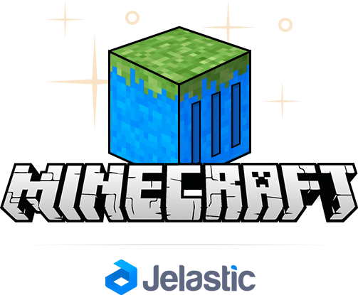
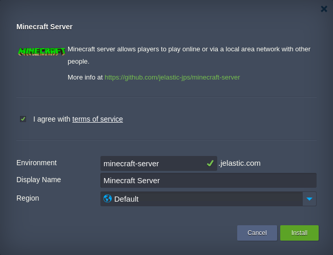

# Personal Minecraft Server Hosting in the Cloud

Set up your own Minecraft server of the latest version inside the Cloud in one click. Being based on **_itzg/minecraft-server_** Docker image, this solution is provided with an automatically generated connection link, that allows to launch your server remotely without external IP address attachment. 

To get your personal Minecraft server inside the cloud, perform the following:
- _if you don’t have Jelastic account yet_ - scroll down to the **Deploy Now** section and follow the provided instruction. 
- _if you have Jelastic account_  - copy link to the **manifest.jps** file above and [import](https://docs.jelastic.com/environment-import) it to the required Jelastic installation.

Within the opened installation confirmation frame, specify your environment data and proceed with **Install**.

Once the installation is completed, select the **Open in browser** button at the appeared notification frame and follow the shown connection instruction.

For detailed guidance, refer to the [Minecraft Server Hosting](http://blog.jelastic.com/2016/11/01/personal-minecraft-server-hosting-docker/) page.

### Deploy Now

Click the **Deploy to Jelastic** button below, specify your email address, choose one of the available cloud hosting providers and proceed with **Install** for automatic registration and package deployment.

 
