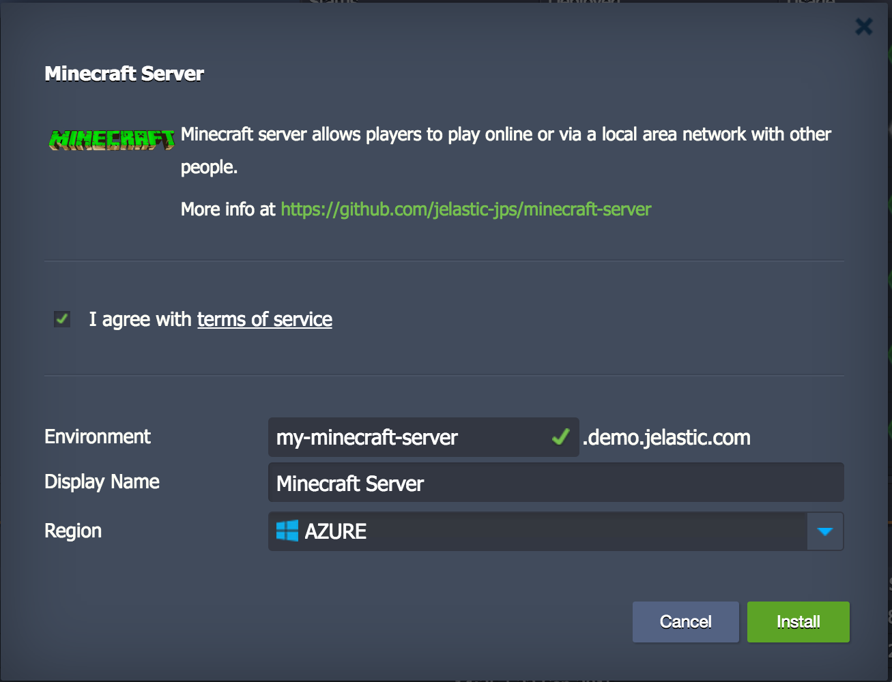

# Minecraft Server

The JPS package deploys and configure Minecraft server.

### Installation Dialog
Simply check "I agree" and press "Install" button

### Deploy Now

Click the deploy button below, specify your email address, choose one of the available cloud providers and press "Install".

 
